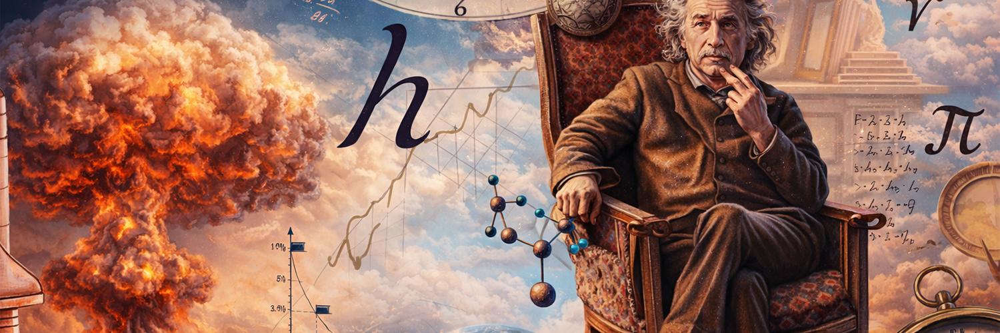
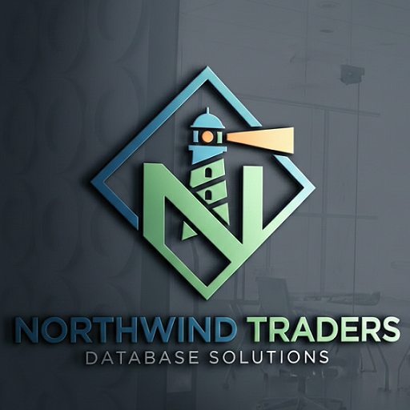
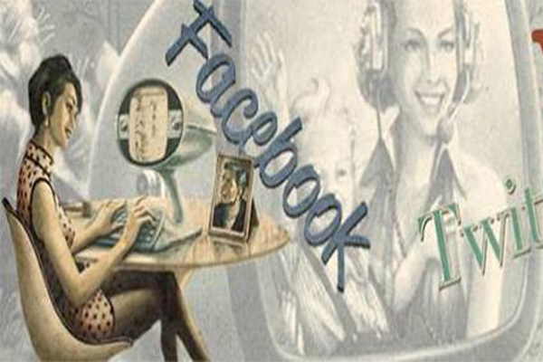

<!-- Banner principal -->

<h1 align="center">Fabasapro — Windows 11 Hater Oficial 🔥</h1>

  <em>Desenvolvedor full-stack que odeia telemetria, bloatware e espionagem da Microsoft. 
  Rust, Python, Linux forever. Open source ou morte.</em>

  <a href="https://twitter.com/fabasapro">𝕏 / Twitter</a> • 
  <a href="https://linkedin.com/in/fabasapro">LinkedIn</a> • 
  <a href="https://fabasapro.dev">Site</a>

<!-- Stats cards - Versão mais estável no momento -->

  <!-- Stats principal (usando fork rápido que está funcionando melhor) -->
  

  <!-- Streak Stats (fork alternativo que muita gente está usando agora) -->
  

 

<!-- Projetos em destaque -->
<h3 align="center">Projetos quentes 🔥</h3>

  
  

<!-- Linguagens -->
<h3 align="center">Linguagens que eu uso (e odeio as que não uso)</h3>

  
  
  
  

<!-- Footer hate -->

  
    
  <strong>Microsoft, vai se foder. 
  Aqui é open source ou nada.</strong>

